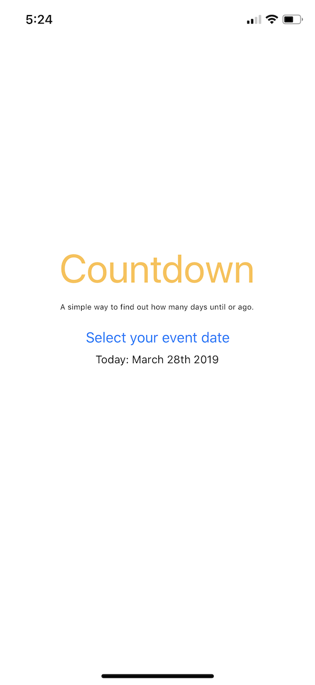

# Countdown App

I created this app to learn React Native and to try develop an IOS app. The app's concept is simple - it counts the number of days between today and any date the user selects.

I used React Native's documentation to build this app.

This is my first project ever with React Native.

# Screenshots




# Getting Started
To use this app, clone the repository and install all dependencies. 
In the folder ```npm start``` 
Download the EXPO app on your IOS device
Once the app starts, use the QR code to view the app on your device

# Future Plans
I plan to deploy this app to the app store soon!

